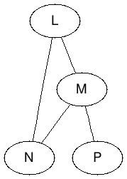

# Introduction

In mathematics, a **graph** is a structure defined by a set of **vertices** and
a set of **edges**, which are the connections between the vertices.

A graph can be represented as:

```
G = (V, E)
```

where 

- `V` or `V(G)` is the set of vertices (e.g., `{a, b, c}`),
- and `E` or `E(G)` is the set of edges (e.g., `{{a, b}, {a, c}, {b, c}}`).

An **undirected graph** is one where the edges have no direction; that is, the
edge `(a, b)` is the same as the edge `(b, a)`. Hence, the edges are *unordered
pairs* represented as sets `{a, b}`.

A **directed graph** is one where the edges have directions; that is, the edge
`(a, b)` is not the same as the edge `(b, a)`. These are represented as sets of
*ordered pairs*.

An **Eulerian path** (or **Eulerian trail**) is a path in a graph which visits
every edge exactly once.

Some common definitions:

- **order** of a graph   - The number of vertices in a graph, denoted as `|V|`.
- **size** of a graph    - The number of edges in a graph, denoted as `|E|`.
- **degree** of a vertex - The number of edges that connect to it.
- **connected** graph    - It is said of a graph that has a path for every pair
                           of vertices it contains.

## Problem

For a given **undirected graph** determine whether there is at least one
Eulerian path starting at the given node. If so, determine how many Eulerian
paths exist starting at that node.

##### CHECK POINT 1

1. Are there any Eulerian paths in the following graph?

   

1. How many Eulerian paths are there for each of the starting vertices?

##### CHECK POINT 2

Take a look at the competition problem sample handed out. Does the problem
relate to the Eulerian path problem? Can it be posed as one?

## Algorithm: Is there an Eulerian path starting at v?

To answer whether or not a graph contains an Eulerian path, it is not necessary
to find the path. It is possible to determine this by simply analyzing the
degree of each vertex.

An *undirected graph* has an Eulerian path if and only if it is **connected**
and **all vertices except possibly two have even degree**. One of those two
vertices that have an odd degree must be the start vertex, and the other one
must be the end vertex.

A *directed graph* has an Eulerian path if and only if it is **connected** and
**each vertex except possibly two have the same in-degree as out-degree**.
Also, if two vertices have different out-degree and in-degree, then one has an
out-degree greater than its in-degree by one--the start node--and the other has
an in-degree that is greater than its out-degree by one--the end node.

##### CHECK POINT 3

1. Why does this algorithm work?

1. Does it match your answer given for *check point #2*?

### Programming Step 1: Build and Execute

The starter code provided uses the gradle build system. You can import the
project to your favorite IDE and build from there if it supports gradle;
otherwise, you should be able to run the build from the command line.

To build the project open a terminal and set the working directory to where the
project was extracted. Run the following:

```
$ ./gradlew build -x test

BUILD SUCCESSFUL in 0s
3 actionable tasks: 3 up-to-date
```

After building you should have a jar that you can run with the sample input
provided in the `build/libs` directory:

```
$ java -cp build/libs/eulerian-path.jar EulerianPath build/resources/main/eulerian.dat
{A=[B], B=[A]}
graph {
    A -- B;
}
NO
{X=[Y, Z], Y=[X, Z], Z=[X, Y]}
graph {
    X -- Y;
    X -- Z;
    Y -- Z;
}
NO
{P=[M], L=[M, N], M=[P, L, N], N=[L, M]}
graph {
    L -- M;
    L -- N;
    M -- N;
    M -- P;
}
NO
```

The code provided has two methods that are useful for inpecting your
intermediate results to understand the algorithms:

##### `printGraph`

Prints the graph loaded into the Graph object as a map where the keys are the
vertices and the values are the connecting vertices.

For the *check point #1* graph it prints:

```
{P=[M], L=[M, N], M=[P, L, N], N=[L, M]}
```

##### `printForGraphViz`

Prints the graph in DOT graphics format:

```
graph {
    L -- M;
    L -- N;
    M -- N;
    M -- P;
}
```

To see it rendered, paste this snippet in: https://graphs.grevian.org/graph

### Programming Step 2: Test

Run the following gradle command to run the `testCountEulerianPaths`:

```
$ ./gradlew test --tests GraphTest.testContainsEulerianPath
...
> Task :test FAILED

GraphTest > testContainsEulerianPath(Graph, String, boolean)[2] FAILED
    org.opentest4j.AssertionFailedError at GraphTest.java:56

GraphTest > testContainsEulerianPath(Graph, String, boolean)[4] FAILED
    org.opentest4j.AssertionFailedError at GraphTest.java:56

4 tests completed, 2 failed
...
BUILD FAILED in 1s
4 actionable tasks: 3 executed, 1 up-to-date
```

##### CHECK POINT 4

Complete the **CHECK POINT 4** methods in the `Graph` class to implement the
algorithm to detect whether there is an Eulerian path.

Run the test again and it should succeed:

```
$ ./gradlew test --tests GraphTest.testContainsEulerianPath
...
BUILD SUCCESSFUL in 1s
4 actionable tasks: 3 executed, 1 up-to-date
```

Also, you can see that half the problem in the handout is complete if you
comment out the lines to print the graph and run the application again:

```
$ java -cp build/libs/eulerian-path.jar EulerianPath build/resources/main/eulerian.dat
YES 0
YES 0
NO
```

## Algorithm: Find an Eulerian path starting at v?

We can use a *depth first search* approach to find one or even all the Eulerian
paths available starting at a given vertex.

1. Starting at vertex v, choose one edge and remove it from the graph. Also,
   remove vertices if they have no remaining edges.
2. If the connecting vertex was not removed (has other connections), then set
   this vertex as the starting vertex and repeat the process to determine if
   there is an Eulerian path in the remaining graph starting from it.
3. If the connecting vertex was removed:
   - If the graph is empty (it was the last vertex), then we have found an
     Eulerian path.
   - Otherwise, the path does not lead to an Eulerian path.

##### CHECK POINT 5

Complete the **CHECK POINT 5** methods in the `Graph` class to implement the
algorithm to find all Eulerian paths.

Run the `testGetEulerianPaths` test again and it should succeed:

```
$ ./gradlew test --tests GraphTest.testGetEulerianPaths

BUILD SUCCESSFUL in 0s
4 actionable tasks: 4 up-to-date
```

##### CHECK POINT 6

Complete the **CHECK POINT 5** methods in the `Graph` class to implement the
algorithm to find all Eulerian paths.

Now you should be able to run all the tests with success:

```
$ ./gradlew test

BUILD SUCCESSFUL in 1s
4 actionable tasks: 2 executed, 2 up-to-date
```

And running the application after building it:

```
$ ./gradlew build

BUILD SUCCESSFUL in 0s
5 actionable tasks: 1 executed, 4 up-to-date

$ java -cp build/libs/eulerian-path.jar EulerianPath build/resources/main/eulerian.dat
YES 1
YES 2
NO
```
